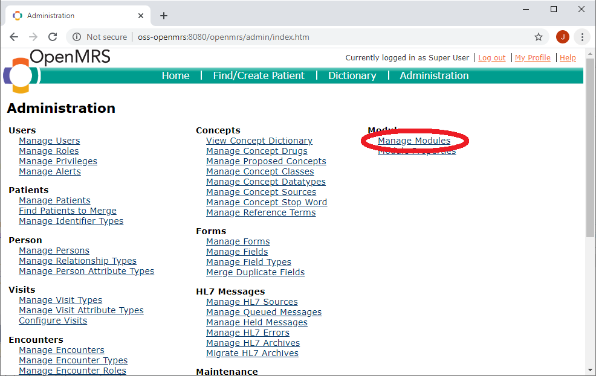
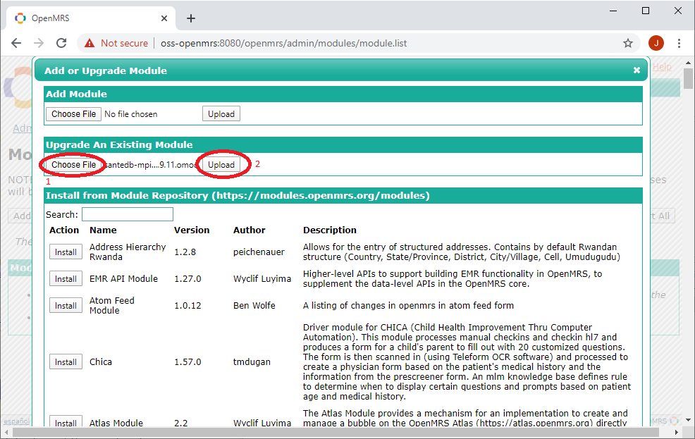
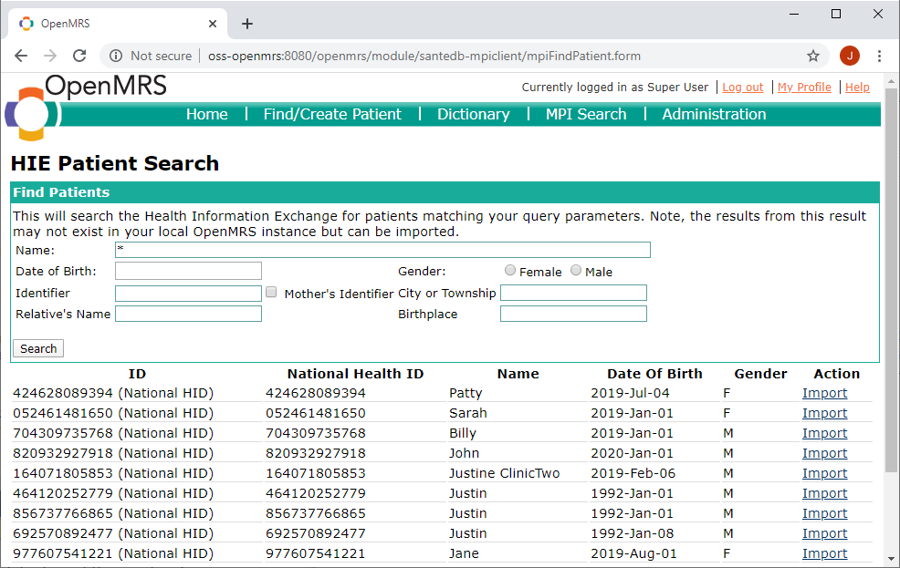

# Installation & Configuration of Module

The overall process of installing the configuring the OpenMRS module is:

1. Obtain (or compile) the OMOD file
2. Upload the OMOD file to your OpenMRS server
3. Configure the OMOD file to your environment
4. Verify connectivity with the MPI

## Obtaining the OMOD file

You can obtain the latest OMOD file from the Releases tab within GitHub, you can also compile the software from source.

To compile from source, clone the software project and build it using Maven and Java JDK8 or higher.

```
$ git clone https://github.com/santedb/openmrs-module-mpi-client
$ mvn clean install
```

The OMOD file will be placed in /omod/target/santedb-mpiclient-x.x.xx.omod.

## Upload the OMOD to OpenMRS

To upload the OMOD into OpenMRS, first login as a super user (admin) and select **Administration** > **Manage Modules** .



You can now upload the module to OpenMRS



If successful, you should see the **MPI Search** option appear in the main header, as well as an indicator the install was successful.


## Configure the Module

Next you'll need to configure the OMOD for your environment. The OMOD can operate using HL7v2.x messages as well as HL7 FHIR messages.

Either configuration is done by visiting **Administration** > **Settings** and selecting the **MPI - Client** section.


Before setup you'll need to answer the following questions:

* Which interface am I using (HL7v2 or FHIR)
* What is the identity domain of this OpenMRS instance?
* What is the identity domain of the enterprise I'm connecting to?
* What are the identity domains from the MPI that I would like this OpenMRS instance to store and use?
* What are the extended attributes in my OpenMRS instance that need to be exposed to the MPI? (V2 only)

In both configurations below, the **example** column is describing an environment as follows:

* **MPI Server:** mpi-server 
  * **HL7v2 Port:** 2100
  * **HTTP Port:** 8080
* **Audit Repository:** ar-server
  * **Port:** 514
  * **Transport:** UDP
* **National Health ID (issued):** MOHS_GEN_NHID (http://mpi-project/identity/mohs/nhid)
* **Enterprise ID:** MOHS_GEN_MPI_INT (http://mpi-project/identity/mohs/mpi)
* **Local OpenMRS Authority:** CLINIC_A_OPENMRS (http://mpi-project/identity/openmrs/clinic)

### Configuration for HL7v2

To configure for HL7v2, use the following reference table of settings. The sample environment being configured here has an MPI at mpi-server on port 2100 and an audit repository at audit-repo on port 514

| Setting | Description | Example Configuration |
|-|-|-|-|
| Background Threads | Not used | false |
| Endpoint Ar Addr | The Audit Repository (IHE ATNA) endpoint | ar-server |
| Endpoint Ar Bind | The address on which to bind UDP traffic | |
| Endpoint Ar Transport | The Audit Transport (UDP or TCP) | audit-udp |
| Endpoint Format | The format to use when communicating with endpoints (hl7 or fhir) | hl7 |
| Endpoint Pdq Addr | The address of the PDQ server | mpi-server |
| Endpoint Pdq Port | The port of the PDQ server | 2100 |
| Endpoint Pix Addr | The address of the PIX server | mpi-server |
| Endpoint Pix Port | The port of the PIX server | 2100 |
| Ext Extended Attributes | The extended attribute mapping (see README.md) | |
| Ext Store NK1 As Relationships | When true, use OpenMRS relationship types instead of extended attributes to store relationships | false |
| Msg Remote Application | If you're connecting to a relay, the ultimate application you want traffic to be routed to, or the MPI server application name | MPI_SERVER |
| Msg Remote Facility | Same as above, but the receiving facility | NATIONAL_DC |
| Msg Sending Application | The sending application identity of this instance (used for authentication) | OMRS_198 |
| Msg Sending Facility | The facility in which the application resides | LOCAL |
| Pid Auto Xref | Identity domains you'd like this OpenMRS instance to subscribe to | MOHS_GEN_NHID |
| Pid Correlation | If you'd like to use a different identity domain other than the local domain to correlate patients, enter it here | |
| Pid Default Country | The default country to append to addresses which lack a country | CA |
| Pid Enterprise | The enterprise identity domain (assigned by MPI) to use when communicating with MPI for fetches | MOHS_GEN_MPI_INT |
| Pid Export Identifier Type | The identity domains to OpenMRS Identifier Type mapping. This is in format INTERNAL=EXTERNAL,.. | National Health ID=MOHS_GEN_NHID |
| Pid Local | The local assigning authority of this instance of OpenMRS (used as the identity domain of the internal patient id) | CLINIC_A_OPENMRS |
| Pid Name Rewrite Regex | Only use if your jurisdiction has naming conventions other than GIVEN FAMILY | |
| Pid NHID | The identity of the national health ID or the "preferred" identity domain (set identifier in OpenMRS as preferred)| MOHS_GEN_NHID |
| Search Date Fuzz | The amount of fuzzyness to add to date searches in years (for search by age) | 0 |
| Security AuthToken | The MSH-8 or client_secret to be used when authenticating against the remote service | XXXX |
| Security IdpAddr | If you require an OAuth IdP (like SanteGuard) to communicate with the MPI, the address of the IdP | |

### Configuration for FHIR

To configure for FHIR, the settings all have the same meaning, they are simply updated to match a FHIR environment.

| Setting | Description | Example Configuration |
|-|-|-|-|
| Background Threads | Not used | false |
| Endpoint Ar Addr | The Audit Repository (IHE ATNA) endpoint | ~~ar-server~~ |
| Endpoint Ar Bind | The address on which to bind UDP traffic | ~~514~~ |
| Endpoint Ar Transport | The Audit Transport (UDP or TCP) | ~~audit-udp~~ |
| Endpoint Format | The format to use when communicating with endpoints (hl7 or fhir) | ~~hl7~~ **fhir** |
| Endpoint Pdq Addr | The address of the PDQ server | ~~mpi-server~~ **http://mpi-server:8080/fhir** |
| Endpoint Pdq Port | The port of the PDQ server | ~~2100~~ **8080** |
| Endpoint Pix Addr | The address of the PIX server | ~~mpi-server~~ **http://mpi-server:8080/fhir** |
| Endpoint Pix Port | The port of the PIX server | ~~2100~~ **8080** |
| Ext Extended Attributes | The extended attribute mapping (see README.md) | |
| Ext Store NK1 As Relationships | When true, use OpenMRS relationship types instead of extended attributes to store relationships | false |
| Msg Remote Application | If you're connecting to a relay, the ultimate application you want traffic to be routed to, or the MPI server application name | MPI_SERVER |
| Msg Remote Facility | Same as above, but the receiving facility | NATIONAL_DC |
| Msg Sending Application | The sending application identity of this instance (used for authentication) | ~~OMRS_198~~ **OpenMRSClientId** |
| Msg Sending Facility | The facility in which the application resides | ~~LOCAL~~ **OpenMRSDeviceId** |
| Pid Auto Xref | Identity domains you'd like this OpenMRS instance to subscribe to | ~~MOHS_GEN_NHID~~ **http://mpi-project/identity/mohs/nhid** |
| Pid Correlation | If you'd like to use a different identity domain other than the local domain to correlate patients, enter it here | |
| Pid Default Country | The default country to append to addresses which lack a country | CA |
| Pid Enterprise | The enterprise identity domain (assigned by MPI) to use when communicating with MPI for fetches | ~~MOHS_GEN_MPI_INT~~ **http://mpi-project/identity/mohs/mpi** |
| Pid Export Identifier Type | The identity domains to OpenMRS Identifier Type mapping. This is in format INTERNAL=EXTERNAL,.. | National Health ID=~~MOHS_GEN_NHID~~**http://mpi-project/identity/mohs/nhid** |
| Pid Local | The local assigning authority of this instance of OpenMRS (used as the identity domain of the internal patient id) | ~~CLINIC_A_OPENMRS~~**http://mpi-project/identity/openmrs/clinic** |
| Pid Name Rewrite Regex | Only use if your jurisdiction has naming conventions other than GIVEN FAMILY | |
| Pid NHID | The identity of the national health ID or the "preferred" identity domain (set identifier in OpenMRS as preferred)| ~~MOHS_GEN_NHID~~ **http://mpi-project/identity/mohs/nhid** |
| Search Date Fuzz | The amount of fuzzyness to add to date searches in years (for search by age) | 0 |
| Security AuthToken | The MSH-8 or client_secret to be used when authenticating against the remote service | XXXX |
| Security IdpAddr | If you require an OAuth IdP (like SanteGuard) to communicate with the MPI, the address of the IdP | **http://mpi-server:8080/auth/oauth2_token** |

## Verify Connectivity

To verify connectivity, click on the **MPI Search** page and search for a patient. If you're using the MEDIC CR or SanteMPI you can use an asterisk in the name field to search any patient.



You can also verify patient creates are working by using the **Find/Create Patient** page and creating a new patient. 

**NOTE:** All create and update transactions run on background workers, so after registering a patient any new information generated by the MPI may take 1-5 seconds to apepar in the user interface. 

